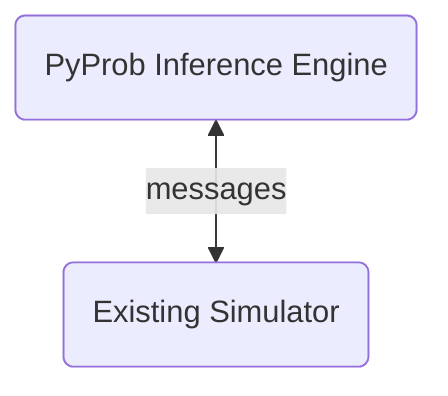

!!! Tip 

    This page contains what you need to know *if you want to extend or modify PyProb*. If you just want to use it, see the tutorials, which contain considerably less details of the machinery.


## Prerequisites

It will help to be familiar with the basics of the probabilistic programming paradigm. [An Introduction to Probabilistic Programming](https://arxiv.org/abs/1809.10756) is a useful reference book.

At minimum, we assume familiarity with probabilistic programs written in terms of `sample` and `observe` statements.

We also assume familiarity with the basic flavours of Bayesian sampling-based inference algorithms. An excellent introduction is given by [these notes](https://ermongroup.github.io/cs228-notes/inference/sampling/) to MCMC and importance sampling.

## Running example

```python
class GaussianUnknownMean(Model):
    def __init__(self):
        pass
    def forward(self):
        mu = pyprob.sample(Normal(1, math.sqrt(5))) 
        likelihood = Normal(mu, math.sqrt(2))
        pyprob.observe(likelihood, name='obs0')
        pyprob.observe(likelihood, name='obs1')
        return m

model = GaussianUnknownMean()
```

`Model` is the core class of PyProb, in which a model is expressed by the `forward` function.

In general, inference algorithms work by sampling execuction *traces*, which amounts to running `forward` and yielding traces to a generator (`trace_generator`). 

The `sample` and `observe` functions are overloaded, and allow the program to be run in different ways. The simplest is forward sampling, where `sample` simply draws a random sample. But in importance sampling, `sample` will draw from a proposal distribution $q$, and reweight appropriately.


## A simulator is a probabilistic program

We can view a simulator as a program which samples from some joint distribution over latent variables $x$ and observed variables $y$. 

This is represented in code as a *trace*, which is a piece of data recording the execution of the simulator (i.e. probabilistic program). For example, here is a trace from the above program:

```python
> model.get_trace()
Trace(variables:3, observable:2, observed:0, tagged:0, controlled:1, uncontrolled:2, log_prob:tensor(-1.9107), log_importance_weight:0.0)
```

This draws a random trace. `log_prob` is the full log probability of this trace. We can inspect the variables like so:

```python
> model.get_trace().variables
[
    Variable(name:None, observable:False, observed:False, tagged:False, control:True, address:16__forward__mu__Normal__1, distribution:Normal(1.0, 2.2360680103302), value:tensor(-0.5545), log_importance_weight:None, log_prob:tensor(-1.9653)),
 
    Variable(name:obs0, observable:True, observed:False, tagged:False, control:False, address:42__forward__?__Normal__1, distribution:Normal(-0.5545016527175903, 1.4142135381698608), value:None, log_importance_weight:None, log_prob:None),
 
    Variable(name:obs1, observable:True, observed:False, tagged:False, control:False, address:56__forward__?__Normal__1, distribution:Normal(-0.5545016527175903, 1.4142135381698608), value:None, log_importance_weight:None, log_prob:None)
]
```

Each variable is a record of the value drawn for that variable, along with important metadata. In particlar, the distribution from which it is sampled, and the *address*, which uniquely identifies that call site.


## Overview

Suppose we have a stochastic simulator in a [supported language](/#supported-languages). This consists of deterministic code interleaved with calls to a random number generator (RNG).

We first compile this code into a seralized form, using FlatBuffers
using PPX
todo check
and replace 
 (select) calls to the RNG with code that sends a message requesting a random number.

This allows the simulator to interact with PyProb, a probabilistic programming language written in Python:



As an example, PyProb can now run the simulator forward by providing values at each site of randomness in the program. Moreover, it can run a range of [standard inference algorithms]((/#supported-inference-methods)). 

## Amortized Inference

Amortized inference is the main use-case of PyProb, since it enables tractable Bayesian inference in large simulators. [These notes](https://www.tuananhle.co.uk/notes/amortized-inference.html) provide a useful overview of the concept in general, and a detailed introduction to its application to probabilistic programs can be found in [this paper](https://arxiv.org/pdf/1610.09900.pdf).

The idea of amortized inference is to learn, usually via a neural network, a mapping from observations to parameters of the posterior distribution, or a proposal for the posterior. Learning this may be slow, but this is a one-time cost, and subsequently, posterior inference for arbitrary observations will be fast.


PyProb focuses on a version of amortized inference known as *compiled inference*, which learns a [weighted importance sampling proposal](https://ermongroup.github.io/cs228-notes/inference/sampling/) $q$. This results in asymptotically exact inference, and if $q$ is near the true posterior $p$, then a relatively low number of samples is required.


### Loss

The neural network is trained to minimize:

$$
\mathcal{L}(\phi) := E_{p(y)}[KL(p(\cdot |y) || q(\cdot | y; \phi))] = E_{p(x,y)}[-\log q(x|y ; \phi)] + K
$$

!!! Note 

    This is the reverse of standard variational inference, which uses $KL(q||p)$.

Since we have access to a sampler for $p(x,y)$, namely the simulator itself, we can take a Monte Carlo estimate of $\nabla_{\phi}\mathcal{L}$:

$$ 
-\sum_i^N \nabla_{\phi}\log q(x_i|y_i ; \phi)
\quad \quad x_i,y_i \sim p
$$

This is a minibatch stochastic gradient descent procedure, where a minibatch $\{(x_i,y_i)\}_0^N$ is drawn from a generator. Note that overfitting is not a concern here: we have access to unlimited data drawn from $p$.


$q$ can be factored into a series of distributions $q_i$, for each of the sites in the simulator.

## Neural network architecture


The goal of the neural network is to map from the inputs (distribution type, address, instance, previous value) to distribution parameters. Since each such mapping should depend on previous time steps, a recurrent architecture is used.

The observation $y$ is embedded via the network $f^\mathrm{obs}$, the sample $x$ is embedded via the network $f^\mathrm{smp}$ and concatenated with one-hot encodings of the address, instance, and proposal type. These are then passed through the LSTM network, the output of which is then passed through a proposal network to finally produce parameters $\eta$ for the proposal distributions corresponding to each sample.

$f^{prop}$, the head which predicts the distribution parameters, necessarily depends on the type of the distribution.

### Observation embedding

### RNN 

The standard choice is an LSTM.

### $f^{prop}$

The output of the LSTM at each timestep is fed into a further network which determines the parameters of the proposal. The type of distribution for the proposal depends on the (prior) distribution of the variable in question, which means that **the neural network depends dynamically on the runtime of the simulator**. This is OK in PyTorch.

The mapping between prior distribution types and proposal distribution types is found in the `_polymorph` function, in `inference_network_lstm.py`.

Options for the `uniform-proposal` are: `beta-mixture`; `truncated-normal-mixture`; `flow`. Options for the `normal-proposal` are: `normal-mixture`; `flow`.


### $f^{obs}$

The mapping from the observation to an embedding. This is something of a one-size-fits-all solution, since the observation can be a number, an image, or really anything.

### Attention

The goal is to help the model learn correlations between the variables, which is of course key to estimating the posterior well. In theory, the LSTM is capable of this, but as you might expect, attention helps.

### Optimization

ADAM is used by default.

## Remote models

The distinctive feature of PyProb is the ability to use a simulator in a separate language, possibly running on a separate machine, as the joint sampler $p(x,y)$.

This requires a communication protocol, in which messages can be sent by the simulator to PyProb describing the distribution to be sampled from at a given point, and messages can be returned by PyProb containing a sample to use.

The details of this communication are hidden by the `RemoteModel` class, so that from the perspective of the Python user, inference proceeds as normal.

### Flatbuffers

### PPX

### PyProb_cpp

### Messages to PyProb

- distribution type

- address 

- instance

### Messages to the simulator

